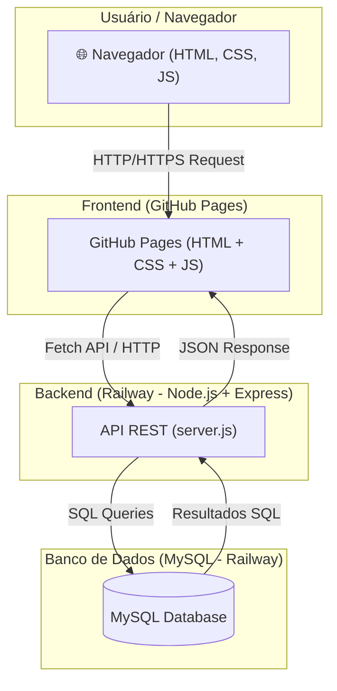
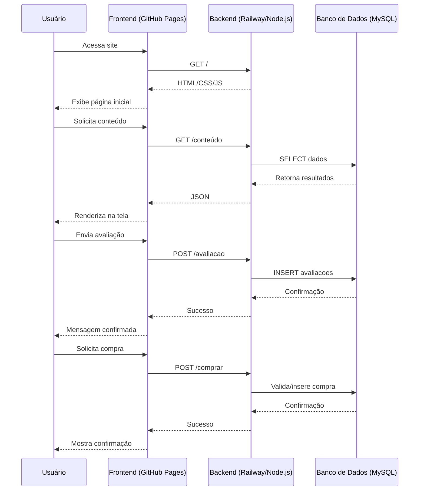

# 📘 Academia da Palavra

Bem-vindo ao repositório da **Academia da Palavra** — um site moderno e interativo voltado para a divulgação e venda de um curso de inglês inovador. O projeto foi desenvolvido com foco em usabilidade, estética e tecnologia, oferecendo aos usuários uma experiência completa com **aulas interativas e conteúdo personalizado**.

---

## 🎯 Objetivo

A **Academia da Palavra** é um site institucional com foco em apresentar e comercializar um curso de inglês que se destaca pelo uso de Inteligência Artificial e aulas adaptativas. 

O projeto visa:

- Apresentar o curso e seus diferenciais
- Exibir conteúdo multimídia (imagens, vídeos e curiosidades)
- Permitir que usuários se interessem, avaliem e comprem o curso
- Oferecer uma experiência imersiva e interativa

---

## 🚀 Funcionalidades

- 🎥 Aula introdutória gratuita com vídeo incorporado
- 🧠 Aulas interativas adaptadas às escolhas do aluno
- 👨‍🏫 Apresentação do professor e metodologia
- ⭐ Avaliações e depoimentos (seção dinâmica)
- 🗺️ Curiosidades culturais sobre o mundo de língua inglesa
- 🌓 Alternância de tema (modo claro/escuro)
- 🛒 Botão de compra com chamada à ação

---

## 🛠️ Tecnologias Utilizadas

### Front-end
- HTML5
- CSS
- JavaScript

### BacKend
- Node.js 
- MySQL

### Hospedagem

- Frontend:https://github.com/

- BacKend:https://railway.com/

- Site: https://isitlucas.github.io/academia-da-palavra/frontend/html/home.html

---

## 📊 Arquitetura

------------------

# 📁 2. Estrutura do Projeto

- /frontend → Código do site (HTML, CSS, JS)
- /backend → API em Node.js + Express
    - /backend/js/server.js → Ponto de entrada
    - /backend/js/db.js → Conexão com o banco
    - /backend/js/controllers.js → Lógica da aplicação
    - /backend/sql → Scripts SQL para criação de tabelas

# 🔄 Diagrama de Sequência – Fluxo de Requisição

------------

# 3️⃣ Clonar ou baixar o código

git clone https://github.com/seu-usuario/academia-da-palavra.git
cd academia-da-palavra/backend

Se não estiver no GitHub, apenas copie a pasta academia-da-palavra para sua máquina.

 Configurar Backend

cd backend
npm install

# 4️⃣ Configurar variáveis de ambiente no backend

No arquivo backend/.env:

DB_HOST=localhost
DB_PORT=3306
DB_USER=academia_user     # ou root se preferir
DB_PASS=senha_forte
DB_DATABASE=academia_da_palavra

SERVER_PORT=3000
SERVER_IP=127.0.0.1

--------------

# 5️⃣ Testar conexão via Node.js

Na pasta backend:

npm start

---------------

# 6️⃣ Testar conexão via Node.js

Na pasta backend:

npm start

Se tudo estiver correto, o servidor:

Conecta ao banco

Cria as tabelas caso não existam (setup_database())

Exibe no terminal:

O servidor está rodando em http://127.0.0.1:3000...

-----------------------

# Extensões
- Live Server: ritwickdey.LiveServer
Hospedar um projeto HTML localmente.

- Live Preview: ms-vscode.live-server
Possibilita a visualização do projeto HTML.

- Material Icon: PKief.material-icon-theme
Temas personalizados para pastas e arquivos.

- Code Runner: formulahendry.code-runner
Possibilita a execução de códigos JavaScript dentro do VSCode.

- JavaScript Code Snippets: xabikos.JavaScriptSnippets
Autocomplete para JavaScript.

- GitLens: eamodio.gitlens

- Git History: donjayamanne.githistory

# Atalhos
- <elemento>.<class>#<id>: Cria um elemento com classe e id definidos.
Exemplo: section.articles#articles

- Alt + Shift + I: Habilita a edição em todas as linhas selecionadas.

- Alt + Shift + F: Automaticamente formata o arquivo selecionado.

- Alt + Z: Ativa / desativa as quebras de linhas automáticas no VS Code.

- Ctrl + F2: Seleciona e habilita a edição em todas as ocorrências de mesma sequência do conteúdo selecionado.

- Ctrl + ;: Comenta o conteúdo selecionado.

- Home: Vai para o início da linha.

- End: Vai para o final da linha.

# Referências
- https://www.w3schools.com/
- https://developer.mozilla.org/docs/Web/HTML/

